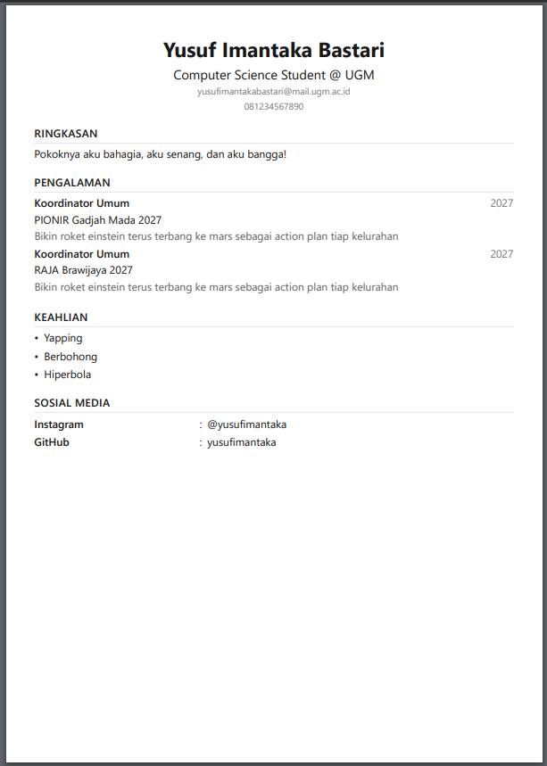

# BuildMyCV

Local-first open source CV builder.

Buat CV dari blok-blok. Simpan di perangkatmu. Tidak perlu akun. Tidak perlu server.



## Fitur

- **Blok CV** — tambah Header, Experience, Skills, Section, atau Paragraf. Susun ulang dari panel Layers atau tombol di dokumen.
- **Rich text** — tekan Ctrl+B, Ctrl+I, atau Ctrl+U di mana saja. Teks tebal, miring, dan garis bawah ikut tercetak di PDF.
- **Panel Layers** — lihat semua blok per halaman. Pilih, urutkan, atau hapus dari satu tempat.
- **19 template** — 11 contoh CV per profesi (kepanitiaan, magang, software engineer, dll) dan 8 template desain (Classic Clear, True Blue, Atlantic Blue, dll).
- **Library** — contoh CV siap pakai per profesi dan kegiatan.
- **Explore** — katalog template desain dengan gaya berbeda.
- **Layout dokumen** — pilih satu kolom atau dua kolom, warna aksen, dan font (sans/serif/mono).
- **Foto profil** — upload foto di header, otomatis dikecilkan dan disimpan lokal.
- **Dark mode** — toggle terang/gelap, tersimpan di browser.
- **Multi halaman** — tambah dan hapus halaman A4.
- **Kertas A4** — preview menyerupai kertas sungguhan.
- **Export PDF** — cetak dari browser, hasil satu halaman per kertas.
- **Simpan lokal** — semua data tersimpan di IndexedDB browser. Aman tanpa akun.
- **Backup & restore** — unduh workspace sebagai file JSON, atau pulihkan dari file backup.
- **Dashboard** — cari CV, urutkan, duplikat, rename, hapus.
- **Open source** — kode tersedia bebas.

## Teknologi

- Next.js 16 (App Router)
- React 19
- TypeScript
- Tailwind CSS v4
- IndexedDB (penyimpanan lokal)
- Iconify (icon dari CDN)

## Cara menjalankan

```bash
npm install
npm run dev
```

Buka http://localhost:3000 di browser.

## Struktur proyek

```text
src/
├── app/
│   ├── _components/dashboard.tsx   # Halaman dashboard
│   └── build/[documentId]/page.tsx # Editor CV
├── domain/
│   ├── cv.ts                       # Tipe data CV dan blok
│   ├── templates.ts                # Katalog template
│   ├── repository.ts               # Kontrak repository
│   ├── in-memory-repository.ts     # Repository di memori
│   └── indexed-db-repository.ts    # Repository IndexedDB
└── types/
    └── iconify.d.ts                # Tipe untuk elemen iconify-icon
```

## Arsitektur

UI tidak pernah menyentuh IndexedDB langsung. Semua akses data lewat `WorkspaceRepository`.

Ada dua implementasi repository:

- `InMemoryRepository` — untuk tes dan pengembangan.
- `IndexedDBRepository` — untuk penyimpanan lokal sungguhan.

Ganti implementasi tidak mengubah UI sama sekali.

## Data

Setiap CV adalah dokumen dengan blok. Tiap blok punya tipe dan data sendiri:

- `header` — nama, judul, email, telepon, foto.
- `experience` — daftar pengalaman kerja.
- `skills` — daftar keahlian.
- `custom` — section bebas dengan label dan isi.
- `paragraph` — judul section dengan paragraf bebas.

Setiap blok bisa dipindah antar halaman, direname, dan diberi gaya sendiri.

## Roadmap

### AI features (rencana)

Banyak orang malas membuat CV langkah demi langkah. Banyak juga yang punya waktu sangat terbatas. AI features dibuat untuk dua kasus ini.

Alur kerja yang direncanakan:

1. **Ceritakan saja.** Pengguna berbicara bebas tentang dirinya, pengalamannya, dan apa yang sudah dia kerjakan. Bisa dengan dictation, suara, atau menulis paragraf biasa.
2. **Paste mentah.** Pengguna menempel teks mentah — riwayat pekerjaan, proyek, atau catatan apa pun. Tidak perlu rapi.
3. **AI memproses.** AI membaca cerita atau teks mentah, lalu mengekstrak informasi penting: posisi, perusahaan, periode, pencapaian, dan keahlian.
4. **CV terisi otomatis.** AI menyusun hasilnya ke dalam blok CV yang sudah ada — header, experience, skills, dan paragraph. Hasilnya langsung tampil di dokumen, bisa diedit seperti biasa.

Konsepnya seperti asisten yang mendengarkan, lalu menuliskan CV untukmu. Kamu tetap punya kendali penuh setelahnya.

### Fitur lain

- AI chat dengan BYOK (bawa kunci API sendiri)
- Hosting opsional berbayar untuk fitur cloud
